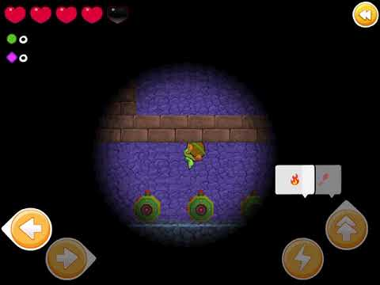

author: @gishi_yama
summary: Google Codelabs ドキュメント作成の素振り
id: odelabpage
categories: codelab,markdown
environments: Web
status: Draft
feedback link: https://github.com/gishi-yama/suburi

# Google Codelabs ドキュメント作成の素振り

## はじめに

Positive
: 敵の潜水艦を発見!

## 次に

Negative
: 駄目だ!

## おわりに

### image

### video

 <video id="hNf_qrEjTnU"></video> 
