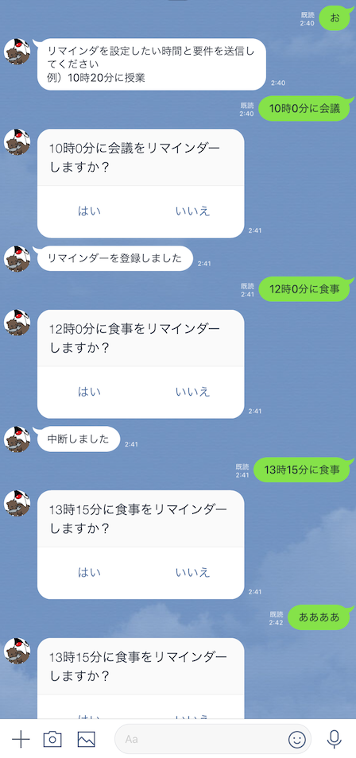

# 課題

[TOC]

時間と用件を送信すると、指定した時間にリマインダーをpushしてくれるlinebotを作成する。

わからない語句があった場合は、Web検索などで確認しておくとよい。

## 前準備

`simple-assistant.zip` ファイルをダウンロードし、わかりやすい場所に展開（解凍）する。

IntelliJ を起動し、展開された `simple-assistant` の pom.xml を選ぶ。

このプロジェクトには、前回利用した line-bot-sdk と、5月頃の授業で学んだデータベース（H2Database）が利用できるように事前セッティングしている。

<div style="page-break-after: always"></div>
## インテント（要求意図）を定義する

### Intent enumを作成

対話システムの場合、ユーザーのメッセージから何を要求しているのかの意図（これをインテントと呼ぶ）を見いだす必要がある。

本来はこの部分も自然言語処理やAI技術を使うことで、より幅広い会話の中に適応したシステムが作れるが、今回は最も基本的な方法として、正規表現で判断をする。

正規表現のマッチ条件と、それに対応するインテントの定義として、 `com.example.simple_assistant` パッケージに、Intent enum を作成する。（クラスの作成時に、`Enum` を選ぶ）

```java
package com.example.simple_assistant;

import lombok.AllArgsConstructor;

import java.util.EnumSet;
import java.util.regex.Pattern;

// ユーザーとのやりとり状態を定義するenum
@AllArgsConstructor
public enum Intent {

  // メッセージの正規表現パターンに対応するやりとり状態の定義
  REMINDER(Pattern.compile("^\\d{1,2}時\\d{1,2}分に.{1.32}$")),
  UNKNOWN(Pattern.compile(".+"));

  private Pattern pattern;

  // メッセージからやりとり状態を判断
  public static Intent makeIntent(String text) {
    var set = EnumSet.allOf(Intent.class);
    return set.stream()
      .filter(i -> i.pattern.matcher(text).matches())
      .findFirst().orElse(UNKNOWN);
  }
}
```

この例では `xx（1 or 2桁の数字）時xx（1 or 2桁の数字）分にxx（32文字までの文字列）` というStringを使って、会話の意図を `REMINDER`：リマインダーの依頼、 `UNKNOWN`：それ以外の状態をわけることができる。

### UserIntent クラスを作成

chatbotは複数人で平行・同時に利用されることがあり得る。

このため、ユーザーごとに「どんな意図の会話をしているか」を分けて管理する必要がある。

ユーザーごとの会話の状態をインスタンスで管理するためのクラスとして、  `com.example.simple_assistant.m` パッケージに、UserIntent クラスを作成する。

```java
package com.example.simple_assistant.m;

import com.example.simple_assistant.Intent;
import com.linecorp.bot.model.event.MessageEvent;
import com.linecorp.bot.model.event.PostbackEvent;
import com.linecorp.bot.model.event.message.TextMessageContent;
import lombok.AllArgsConstructor;
import lombok.Value;

import java.util.Objects;

// あるユーザーの状態とメッセージを記録しておく
@Value
@AllArgsConstructor
public class UserIntent {

  private String userId;
  private Intent intent;
  private String text;

  public UserIntent(MessageEvent<TextMessageContent> event) {
    this.userId = event.getSource().getUserId();
    this.text = event.getMessage().getText();
    this.intent = Intent.makeIntent(text);
  }

  public UserIntent(PostbackEvent event) {
    this.userId = event.getSource().getUserId();
    this.text = event.getPostbackContent().getData();
    this.intent = Intent.makeIntent(text);
  }

  public boolean containsUserId(String userId) {
    return Objects.equals(this.userId, userId);
  }

}
```

<div style="page-break-after: always"></div>
## インテントにあわせて返答する

LineBotに投げかけられたメッセージから、 Intent が `UNKNOWN`, `REMINDER` のどちらかを判断し、返答メッセージを変えるChatbotが作れる。

クラスのコードが長いので間違えないように。

import は先に作るのではなく、コード入力時にIntelliJに補完してもらうように進めた方が早く完成する。

```java
package com.example.simple_assistant.c;

import com.example.simple_assistant.m.UserIntent;
import com.linecorp.bot.model.action.PostbackAction;
import com.linecorp.bot.model.event.MessageEvent;
import com.linecorp.bot.model.event.PostbackEvent;
import com.linecorp.bot.model.event.message.TextMessageContent;
import com.linecorp.bot.model.message.Message;
import com.linecorp.bot.model.message.TemplateMessage;
import com.linecorp.bot.model.message.TextMessage;
import com.linecorp.bot.model.message.template.ConfirmTemplate;
import com.linecorp.bot.spring.boot.annotation.EventMapping;
import com.linecorp.bot.spring.boot.annotation.LineMessageHandler;
import org.springframework.beans.factory.annotation.Autowired;
import org.springframework.context.annotation.Bean;

import java.util.Collections;
import java.util.HashSet;
import java.util.Optional;
import java.util.Set;
import java.util.function.Predicate;

@LineMessageHandler
public class CallBack {

  // ユーザごとの処理状態を記録する
  private Set<UserIntent> userIntents;

  @Autowired
  public CallBack(Set<UserIntent> userIntents) {
    this.userIntents = userIntents;
  }

  // 起動時にuserIntentsを初期化する
  @Bean
  public Set<UserIntent> userIntents() {
    return Collections.synchronizedSet(new HashSet<>());
  }

  // MessageEventに対応する
  @EventMapping
  public Message handleMessage(MessageEvent<TextMessageContent> event) {
    var userIntent = new UserIntent(event);
    return handleIntent(userIntent);
  }

  // PostBackEventに対応する
  @EventMapping
  public Message handlePostBack(PostbackEvent event) {
    var userIntent = new UserIntent(event);
    var msg = getPostBackMsg(userIntent.getText());
    upsertUserIntent(userIntent);
    return msg;
  }

  // 返すメッセージのハンドリングをする
  // リマインダー登録処理の途中で不正な入力があれば、再帰的に状態を復帰する
  Message handleIntent(UserIntent userIntent) {
    Message msg = getUnknownReaMsg();
    var intent = userIntent.getIntent();
    switch (intent) {
      case REMINDER:
        upsertUserIntent(userIntent);
        msg = getRemainderConfirmMsg(userIntent.getText());
        break;
      case UNKNOWN:
      default:
        msg = getUserIntentIf(ui -> ui.containsUserId(userIntent.getUserId()))
          .map(this::handleIntent)
          .orElse(msg);
    }
    return msg;
  }

  // userIntentsフィールドに、指定された条件のものがあれば取り出す
  Optional<UserIntent> getUserIntentIf(Predicate<UserIntent> filter) {
    return userIntents.stream()
      .filter(filter)
      .findFirst();
  }

  // userIntentsフィールドを、新しいものに置き換える
  void upsertUserIntent(UserIntent newOne) {
    userIntents.removeIf(ui -> ui.containsUserId(newOne.getUserId()));
    userIntents.add(newOne);
  }

  // TextEventで、指示不明の場合の返答メッセージを作る
  Message getUnknownReaMsg() {
    return new TextMessage("リマインダを設定したい時分と用件（32文字まで）を送信してください\n例）10時20分に授業");
  }

  // TextEventで、リマインダーの場合の返答メッセージを作る
  Message getRemainderConfirmMsg(String text) {
    var template = new ConfirmTemplate(text + "をリマインダーしますか？",
      new PostbackAction("はい", "RY"),
      new PostbackAction("いいえ", "RN"));
    return new TemplateMessage(text, template);
  }

  // PostBackEventに対するメッセージを作る
  Message getPostBackMsg(String actionData) {
    TextMessage msg = new TextMessage("中断しました");
    switch (actionData) {
      case "RY":
        msg = new TextMessage("リマインダーを登録しました");
        break;
      case "RN":
      default:
    }
    return msg;
  }

}
```

クラスが完成したら、一度ソースコードを読み、処理の流れを確認しなさい。

また、LINE Developer のサイトから `Channel Secret`, `アクセストークン（ロングターム）` の値をもらい、 `application.properties` の項目を修正しなさい。

さらに ngrok で取得したURLを LINE Developer のサイトに登録し、アプリケーションを動作させ、動作確認を行いなさい。

（このあたりの動作のさせ方を忘れた学生は、前回の課題ファイルを参照）

下の画像のように会話を行い、動作を確認しなさい。<br>特に、handleIntent メソッドのswitch文では再帰処理を使い、リマインダーの確認状態の時に他の話題が投稿されても、確認を続けるように工夫している。



<div style="page-break-after: always"></div>
## リマインダーをデータベースに保存する


Import